# DATABASE.md

## 1. Tables

| Table Name               | Columns (name: type)                                                                                                                                                                                                                                                                                                                                                                                                                                                                                                                                                                                                                                          | Primary Key | Foreign Keys                                                                                                                                                                                                   |
| ------------------------ | ------------------------------------------------------------------------------------------------------------------------------------------------------------------------------------------------------------------------------------------------------------------------------------------------------------------------------------------------------------------------------------------------------------------------------------------------------------------------------------------------------------------------------------------------------------------------------------------------------------------------------------------------------------- | ----------- | -------------------------------------------------------------------------------------------------------------------------------------------------------------------------------------------------------------- |
| partners                 | id: uuid, org_name: text, partner_type: text, access_level: integer, commission_rate: numeric, onboarding_completed: boolean, created_at: timestamptz, updated_at: timestamptz                                                                                                                                                                                                                                                                                                                                                                                                                                                                                | id          | partners.id : None (referenced by many)                                                                                                                                                                        |
| profiles                 | id: uuid, email: text, username: text, full_name: text, phone: text, partner_id: uuid, parent_user_id: uuid, role: text, access_level: integer, permissions: jsonb, is_first_login: boolean, is_active: boolean, created_at: timestamptz, updated_at: timestamptz                                                                                                                                                                                                                                                                                                                                                                                             | id          | profiles.partner_id → partners.id; profiles.parent_user_id → profiles.id; profiles.id → auth.users.id                                                                                                          |
| campaigns                | id: uuid, campaign_name: text, name: text, promo_code: text, partner_id: uuid, program_id: uuid, created_by_user_id: uuid, created_by_user_role: text, duration_start: timestamptz, duration_end: timestamptz, allocated_budget: numeric, budget: numeric, spent: numeric, revenue_projection: numeric, target_signups: integer, daily_target: integer, channels: jsonb, target_audience: jsonb, performance_metrics: jsonb, metadata: jsonb, whatsapp_number: text, bundled_offers: jsonb, discount_rule: jsonb, revenue_share: jsonb, status: text, created_at: timestamptz, updated_at: timestamptz                                                        | id          | campaigns.partner_id → partners.id; campaigns.program_id → programs.id; campaigns.created_by_user_id → profiles.id                                                                                             |
| programs                 | id: uuid, program_name: text, name: text, description: text, partner_id: uuid, created_by_user_id: uuid, curriculum_subjects: jsonb, enrollment_count: integer, capacity: integer, metadata: jsonb, start_date: timestamptz, end_date: timestamptz, status: text, budget: numeric, created_at: timestamptz, updated_at: timestamptz                                                                                                                                                                                                                                                                                                                           | id          | programs.partner_id → partners.id; programs.created_by_user_id → profiles.id                                                                                                                                   |
| tasks                    | id: uuid, partner_id: uuid, campaign_id: uuid, program_id: uuid, created_by_user_id: uuid, approver_id: uuid, approver_user_id: uuid, assigned_to_user_id: uuid, task_name: text, reference_no: text, description: text, priority: text, status: text, approval_notes: text, approval_date: timestamptz, rejection_reason: text, due_date: timestamptz, completion_date: timestamptz, completed_at: timestamptz, metadata: jsonb, created_at: timestamptz, updated_at: timestamptz, date_created: timestamptz                                                                                                                                                 | id          | tasks.partner_id → partners.id; tasks.campaign_id → campaigns.id; tasks.program_id → programs.id; tasks.created_by_user_id → profiles.id; tasks.approver_id/approver_user_id/assigned_to_user_id → profiles.id |
| audit_logs               | id: uuid, user_id: uuid, action: text, action_type: text, resource_type: text, resource_id: text, changes: jsonb, ip_address: text, user_agent: text, timestamp: timestamptz                                                                                                                                                                                                                                                                                                                                                                                                                                                                                  | id          | audit_logs.user_id → profiles.id                                                                                                                                                                               |
| user_activity_log        | id: uuid, partner_id: uuid, user_id: uuid, parent_user_id: uuid, entity_type: text, entity_id: uuid, before_state: jsonb, after_state: jsonb, change_summary: text, ip_address: inet, user_agent: text, action: text, action_type: text, details: text, timestamp: timestamptz                                                                                                                                                                                                                                                                                                                                                                                | id          | user_activity_log.user_id → profiles.id; user_activity_log.parent_user_id → profiles.id; user_activity_log.partner_id → partners.id                                                                            |
| user_performance_metrics | id: uuid, partner_id: uuid, user_id: uuid, parent_user_id: uuid, campaign_id: uuid, metric_date: date, campaigns_created: integer, campaigns_completed: integer, tasks_completed: integer, tasks_approved: integer, engagement_score: numeric, conversion_count: integer, click_through_rate: numeric, impressions: integer, revenue_generated: numeric, roi: numeric, metadata: jsonb, total_campaigns: integer, active_campaigns: integer, total_earnings: numeric, pending_withdrawals: numeric, completed_tasks: integer, pending_tasks: integer, performance_score: numeric, last_updated: timestamptz, created_at: timestamptz, updated_at: timestamptz | id          | user_performance_metrics.partner_id → partners.id; user_performance_metrics.user_id → profiles.id; user_performance_metrics.parent_user_id → profiles.id; user_performance_metrics.campaign_id → campaigns.id  |
| wallets                  | id: uuid, partner_id: uuid, user_id: uuid, paybill_number: text, account_number: text, balance: numeric, total_earnings: numeric, pending_withdrawals: numeric, payment_method: text, is_active: boolean, last_transaction_at: timestamptz, created_at: timestamptz, updated_at: timestamptz                                                                                                                                                                                                                                                                                                                                                                  | id          | wallets.partner_id → partners.id; wallets.user_id → profiles.id                                                                                                                                                |
| transactions             | id: uuid, wallet_id: uuid, partner_id: uuid, user_id: uuid, campaign_id: uuid, transaction_type: text, amount: numeric, description: text, reference_number: text, metadata: jsonb, status: text, created_at: timestamptz, updated_at: timestamptz                                                                                                                                                                                                                                                                                                                                                                                                            | id          | transactions.wallet_id → wallets.id; transactions.user_id → profiles.id; transactions.partner_id → partners.id; transactions.campaign_id → campaigns.id                                                        |
| withdrawals              | id: uuid, wallet_id: uuid, partner_id: uuid, user_id: uuid, amount: numeric, withdrawal_method: text, mpesa_reference: text, bank_reference: text, rejection_reason: text, reviewed_by_user_id: uuid, review_notes: text, processed_at: timestamptz, completed_at: timestamptz, status: text, created_at: timestamptz, updated_at: timestamptz                                                                                                                                                                                                                                                                                                                | id          | withdrawals.wallet_id → wallets.id; withdrawals.partner_id → partners.id; withdrawals.user_id → profiles.id; withdrawals.reviewed_by_user_id → profiles.id                                                     |
| wallet_history           | id: uuid, wallet_id: uuid, action: text, previous_balance: numeric, new_balance: numeric, change_amount: numeric, reason: text, metadata: jsonb, created_at: timestamptz                                                                                                                                                                                                                                                                                                                                                                                                                                                                                      | id          | wallet_history.wallet_id → wallets.id                                                                                                                                                                          |
| team_members             | id: uuid, partner_id: uuid, user_id: uuid, campaign_id: uuid, program_id: uuid, role: text, permission_level: text, is_active: boolean, invited_at: timestamptz, removed_at: timestamptz, metadata: jsonb, created_at: timestamptz, updated_at: timestamptz                                                                                                                                                                                                                                                                                                                                                                                                   | id          | team_members.partner_id → partners.id; team_members.user_id → profiles.id; team_members.campaign_id → campaigns.id; team_members.program_id → programs.id                                                      |

### Relations (foreign keys)

- profiles.partner_id → partners.id
- profiles.parent_user_id → profiles.id
- profiles.id → auth.users.id
- campaigns.partner_id → partners.id
- campaigns.program_id → programs.id
- campaigns.created_by_user_id → profiles.id
- programs.partner_id → partners.id
- programs.created_by_user_id → profiles.id
- tasks.partner_id → partners.id
- tasks.campaign_id → campaigns.id
- tasks.program_id → programs.id
- tasks.created_by_user_id → profiles.id
- tasks.approver_id / approver_user_id / assigned_to_user_id → profiles.id
- audit_logs.user_id → profiles.id
- user_activity_log.user_id / parent_user_id → profiles.id
- user_activity_log.partner_id → partners.id
- user_performance_metrics.partner_id → partners.id
- user_performance_metrics.user_id → profiles.id
- user_performance_metrics.parent_user_id → profiles.id
- user_performance_metrics.campaign_id → campaigns.id
- wallets.partner_id → partners.id
- wallets.user_id → profiles.id
- transactions.wallet_id → wallets.id
- transactions.user_id → profiles.id
- transactions.partner_id → partners.id
- transactions.campaign_id → campaigns.id
- withdrawals.wallet_id → wallets.id
- withdrawals.user_id → profiles.id
- withdrawals.partner_id → partners.id
- withdrawals.reviewed_by_user_id → profiles.id
- wallet_history.wallet_id → wallets.id
- team_members.partner_id → partners.id
- team_members.user_id → profiles.id
- team_members.campaign_id → campaigns.id
- team_members.program_id → programs.id

---

## 2. Functions

| Function Name                              | Parameters                                                                                                                                                                                      | Return Type                                                                      | Definition           |
| ------------------------------------------ | ----------------------------------------------------------------------------------------------------------------------------------------------------------------------------------------------- | -------------------------------------------------------------------------------- | -------------------- |
| create_user_profile                        | p_email text, p_full_name text, p_phone text DEFAULT NULL, p_username text DEFAULT NULL                                                                                                         | TABLE(id uuid, email text, full_name text, phone text, username text, role text) | see definition below |
| create_user_profile (auth variant)         | p_auth_id uuid, p_email text, p_full_name text, p_phone text, p_username text DEFAULT NULL                                                                                                      | TABLE(id uuid, email text, full_name text, phone text, username text, role text) | see definition below |
| get_user_partner_id                        | p_user_id uuid                                                                                                                                                                                  | uuid                                                                             | see definition below |
| handle_campaigns_updated_at                | (none)                                                                                                                                                                                          | trigger                                                                          | see definition below |
| handle_partners_updated_at                 | (none)                                                                                                                                                                                          | trigger                                                                          | see definition below |
| handle_profiles_updated_at                 | (none)                                                                                                                                                                                          | trigger                                                                          | see definition below |
| handle_programs_updated_at                 | (none)                                                                                                                                                                                          | trigger                                                                          | see definition below |
| handle_tasks_updated_at                    | (none)                                                                                                                                                                                          | trigger                                                                          | see definition below |
| handle_transactions_updated_at             | (none)                                                                                                                                                                                          | trigger                                                                          | see definition below |
| handle_user_performance_metrics_updated_at | (none)                                                                                                                                                                                          | trigger                                                                          | see definition below |
| handle_wallets_updated_at                  | (none)                                                                                                                                                                                          | trigger                                                                          | see definition below |
| handle_withdrawals_updated_at              | (none)                                                                                                                                                                                          | trigger                                                                          | see definition below |
| is_authenticated                           | (none)                                                                                                                                                                                          | boolean                                                                          | see definition below |
| is_campaign_owner                          | p_campaign_id uuid, p_user_id uuid                                                                                                                                                              | boolean                                                                          | see definition below |
| is_partner_admin                           | p_partner_id uuid                                                                                                                                                                               | boolean                                                                          | see definition below |
| is_program_owner                           | p_program_id uuid, p_user_id uuid                                                                                                                                                               | boolean                                                                          | see definition below |
| is_super_admin                             | p_user_id uuid                                                                                                                                                                                  | boolean                                                                          | see definition below |
| is_task_approver                           | p_task_id uuid, p_user_id uuid                                                                                                                                                                  | boolean                                                                          | see definition below |
| log_activity                               | p_partner_id uuid, p_user_id uuid, p_action text, p_entity_type text, p_entity_id uuid, p_before_state jsonb DEFAULT NULL, p_after_state jsonb DEFAULT NULL, p_change_summary text DEFAULT NULL | uuid                                                                             | see definition below |
| rpc_approve_task                           | p_task_id uuid, p_approver_user_id uuid, p_approval_notes text DEFAULT NULL                                                                                                                     | jsonb                                                                            | see definition below |
| rpc_create_campaign                        | p_partner_id uuid, p_created_by_user_id uuid, p_campaign_name text, p_duration_start timestamptz, p_duration_end timestamptz, ...                                                               | jsonb                                                                            | see definition below |
| rpc_create_program                         | p_partner_id uuid, p_created_by_user_id uuid, p_program_name text, p_start_date timestamptz, p_end_date timestamptz, ...                                                                        | jsonb                                                                            | see definition below |
| rpc_create_team_member                     | p_partner_id uuid, p_user_id uuid, p_role text, ...                                                                                                                                             | jsonb                                                                            | see definition below |
| rpc_delete_campaign                        | p_campaign_id uuid                                                                                                                                                                              | jsonb                                                                            | see definition below |
| rpc_delete_program                         | p_program_id uuid                                                                                                                                                                               | jsonb                                                                            | see definition below |
| rpc_log_audit_event                        | p_action text, p_action_type text, p_resource_type text DEFAULT NULL, p_resource_id text DEFAULT NULL, p_changes jsonb DEFAULT NULL                                                             | uuid                                                                             | see definition below |
| rpc_onboard_partner_user                   | p_org_name text, p_partner_type text, p_user_email text, p_user_password text, p_full_name text, p_role text DEFAULT 'team_member'                                                              | jsonb                                                                            | see definition below |
| rpc_process_withdrawal                     | p_withdrawal_id uuid, p_status text, p_reviewed_by_user_id uuid, p_review_notes text DEFAULT NULL, p_mpesa_reference text DEFAULT NULL                                                          | jsonb                                                                            | see definition below |
| rpc_record_transaction                     | p_wallet_id uuid, p_partner_id uuid, p_user_id uuid, p_transaction_type text, p_amount numeric, ...                                                                                             | jsonb                                                                            | see definition below |
| rpc_reject_task                            | p_task_id uuid, p_approver_user_id uuid, p_rejection_reason text                                                                                                                                | jsonb                                                                            | see definition below |
| rpc_request_withdrawal                     | p_wallet_id uuid, p_partner_id uuid, p_user_id uuid, p_amount numeric, ...                                                                                                                      | jsonb                                                                            | see definition below |
| rpc_update_campaign                        | p_campaign_id uuid, p_campaign_name text DEFAULT NULL, ...                                                                                                                                      | jsonb                                                                            | see definition below |
| rpc_update_program                         | p_program_id uuid, p_program_name text DEFAULT NULL, ...                                                                                                                                        | jsonb                                                                            | see definition below |
| rpc_update_team_member                     | p_team_member_id uuid, p_role text DEFAULT NULL, ...                                                                                                                                            | jsonb                                                                            | see definition below |
| sync_verified_user_profile                 | (trigger)                                                                                                                                                                                       | trigger                                                                          | see definition below |

### Function definitions

Below are the full SQL definitions for each function collected (kept verbatim):

#### create_user_profile

```sql
CREATE OR REPLACE FUNCTION public.create_user_profile(p_email text, p_full_name text, p_phone text DEFAULT NULL::text, p_username text DEFAULT NULL::text)
 RETURNS TABLE(id uuid, email text, full_name text, phone text, username text, role text)
 LANGUAGE plpgsql
 SECURITY DEFINER
AS $function$
DECLARE
  v_user_id UUID;
BEGIN
  -- Ensure the caller is authenticated
  IF auth.uid() IS NULL THEN
    RAISE EXCEPTION
      'Not authenticated. Email verification required before profile creation.';
  END IF;

  -- Insert profile
  INSERT INTO public.profiles (
    id,
    email,
    full_name,
    phone,
    username,
    role
  )
  VALUES (
    auth.uid(),
    p_email,
    p_full_name,
    COALESCE(p_phone, ''),
    COALESCE(p_username, ''),
    'team_member'
  )
  RETURNING id INTO v_user_id;

  -- Return the created profile from the table
  RETURN QUERY
  SELECT
    p.id,
    p.email,
    p.full_name,
    COALESCE(p.phone, ''),
    COALESCE(p.username, ''),
    p.role
  FROM public.profiles p
  WHERE p.id = v_user_id;

EXCEPTION
  WHEN unique_violation THEN
    RAISE EXCEPTION
      'Email or username already exists. User may already be registered.';
  WHEN OTHERS THEN
    RAISE EXCEPTION
      'Profile creation failed: %',
      SQLERRM;
END;
$function$
```

#### get_user_partner_id

```sql
CREATE OR REPLACE FUNCTION public.get_user_partner_id(p_user_id uuid)
 RETURNS uuid
 LANGUAGE plpgsql
 SECURITY DEFINER
AS $function$
DECLARE
  v_partner_id UUID;
BEGIN
  SELECT partner_id INTO v_partner_id
  FROM public.profiles
  WHERE id = p_user_id
  LIMIT 1;

  RETURN v_partner_id;
END;
$function$
```

#### is_authenticated

```sql
CREATE OR REPLACE FUNCTION public.is_authenticated()
 RETURNS boolean
 LANGUAGE plpgsql
 STABLE
AS $function$
BEGIN
  RETURN auth.uid() IS NOT NULL;
END;
$function$
```

#### is_super_admin

```sql
CREATE OR REPLACE FUNCTION public.is_super_admin(p_user_id uuid)
 RETURNS boolean
 LANGUAGE plpgsql
 SECURITY DEFINER
AS $function$
BEGIN
  RETURN EXISTS (
    SELECT 1 FROM public.profiles
    WHERE id = p_user_id
    AND role IN ('super_admin', 'system_admin')
  );
END;
$function$
```

#### is_partner_admin

```sql
CREATE OR REPLACE FUNCTION public.is_partner_admin(p_partner_id uuid)
 RETURNS boolean
 LANGUAGE plpgsql
 STABLE
AS $function$
BEGIN
  RETURN EXISTS(
    SELECT 1 FROM public.profiles
    WHERE partner_id = p_partner_id
    AND (role ILIKE '%admin%' OR public.is_super_admin(id))
  );
END;
$function$
```

#### is_campaign_owner

```sql
CREATE OR REPLACE FUNCTION public.is_campaign_owner(p_campaign_id uuid, p_user_id uuid)
 RETURNS boolean
 LANGUAGE plpgsql
 SECURITY DEFINER
AS $function$
DECLARE
  v_creator_id UUID;
BEGIN
  SELECT created_by_user_id INTO v_creator_id
  FROM public.campaigns
  WHERE id = p_campaign_id;

  RETURN v_creator_id = p_user_id;
END;
$function$
```

#### is_program_owner

```sql
CREATE OR REPLACE FUNCTION public.is_program_owner(p_program_id uuid, p_user_id uuid)
 RETURNS boolean
 LANGUAGE plpgsql
 SECURITY DEFINER
AS $function$
DECLARE
  v_creator_id UUID;
BEGIN
  SELECT created_by_user_id INTO v_creator_id
  FROM public.programs
  WHERE id = p_program_id;

  RETURN v_creator_id = p_user_id;
END;
$function$
```

#### is_task_approver

```sql
CREATE OR REPLACE FUNCTION public.is_task_approver(p_task_id uuid, p_user_id uuid)
 RETURNS boolean
 LANGUAGE plpgsql
 SECURITY DEFINER
AS $function$
DECLARE
  v_approver_id UUID;
BEGIN
  SELECT approver_user_id INTO v_approver_id
  FROM public.tasks
  WHERE id = p_task_id;

  RETURN v_approver_id = p_user_id OR public.is_super_admin(p_user_id);
END;
$function$
```

#### log_activity

```sql
CREATE OR REPLACE FUNCTION public.log_activity(p_partner_id uuid, p_user_id uuid, p_action text, p_entity_type text, p_entity_id uuid, p_before_state jsonb DEFAULT NULL::jsonb, p_after_state jsonb DEFAULT NULL::jsonb, p_change_summary text DEFAULT NULL::text)
 RETURNS uuid
 LANGUAGE plpgsql
 SECURITY DEFINER
AS $function$
DECLARE
  v_activity_id UUID;
  v_ip_address INET;
  v_user_agent TEXT;
BEGIN
  v_ip_address := inet_client_addr();
  BEGIN
    v_user_agent := current_setting('http.headers')::jsonb->>'user-agent';
  EXCEPTION WHEN OTHERS THEN
    v_user_agent := NULL;
  END;

  INSERT INTO public.user_activity_log (
    partner_id, user_id, action, entity_type, entity_id,
    before_state, after_state, change_summary,
    ip_address, user_agent, created_at
  )
  VALUES (
    p_partner_id, p_user_id, p_action, p_entity_type, p_entity_id,
    p_before_state, p_after_state, p_change_summary,
    v_ip_address, v_user_agent, CURRENT_TIMESTAMP
  )
  RETURNING id INTO v_activity_id;

  RETURN v_activity_id;
END;
$function$
```

#### rpc_approve_task

```sql
CREATE OR REPLACE FUNCTION public.rpc_approve_task(p_task_id uuid, p_approver_user_id uuid, p_approval_notes text DEFAULT NULL::text)
 RETURNS jsonb
 LANGUAGE plpgsql
 SECURITY DEFINER
AS $function$
DECLARE
  v_task RECORD;
  v_user_id UUID;
BEGIN
  v_user_id := COALESCE(p_approver_user_id, auth.uid());

  SELECT * INTO v_task FROM public.tasks WHERE id = p_task_id;

  IF v_task IS NULL THEN
    RETURN jsonb_build_object('success', false, 'error', 'Task not found');
  END IF;

  UPDATE public.tasks
  SET status = 'approved', approver_user_id = v_user_id, approval_notes = p_approval_notes, approval_date = CURRENT_TIMESTAMP, updated_at = CURRENT_TIMESTAMP
  WHERE id = p_task_id;

  PERFORM public.log_activity(v_task.partner_id, v_user_id, 'approved', 'task', p_task_id, NULL, NULL, 'Task approved: ' || COALESCE(v_task.task_name, 'Task ' || p_task_id));

  RETURN jsonb_build_object('success', true, 'task_id', p_task_id, 'status', 'approved', 'message', 'Task approved successfully');

EXCEPTION WHEN OTHERS THEN
  RETURN jsonb_build_object('success', false, 'error', SQLERRM);
END;
$function$
```

#### rpc_reject_task

```sql
CREATE OR REPLACE FUNCTION public.rpc_reject_task(p_task_id uuid, p_approver_user_id uuid, p_rejection_reason text)
 RETURNS jsonb
 LANGUAGE plpgsql
 SECURITY DEFINER
AS $function$
DECLARE
  v_task RECORD;
  v_user_id UUID;
BEGIN
  v_user_id := COALESCE(p_approver_user_id, auth.uid());
  SELECT * INTO v_task FROM public.tasks WHERE id = p_task_id;

  IF v_task IS NULL THEN
    RETURN jsonb_build_object('success', false, 'error', 'Task not found');
  END IF;

  IF p_rejection_reason IS NULL OR p_rejection_reason = '' THEN
    RETURN jsonb_build_object('success', false, 'error', 'Rejection reason is required');
  END IF;

  UPDATE public.tasks SET status = 'declined', approver_user_id = v_user_id, rejection_reason = p_rejection_reason, updated_at = CURRENT_TIMESTAMP WHERE id = p_task_id;

  PERFORM public.log_activity(v_task.partner_id, v_user_id, 'rejected', 'task', p_task_id, NULL, NULL, 'Task rejected: ' || COALESCE(v_task.task_name, 'Task ' || p_task_id) || ' - ' || p_rejection_reason);

  RETURN jsonb_build_object('success', true, 'task_id', p_task_id, 'status', 'declined', 'message', 'Task rejected successfully');

EXCEPTION WHEN OTHERS THEN
  RETURN jsonb_build_object('success', false, 'error', SQLERRM);
END;
$function$
```

#### rpc_create_campaign

```sql
CREATE OR REPLACE FUNCTION public.rpc_create_campaign(p_partner_id uuid, p_created_by_user_id uuid, p_campaign_name text, p_duration_start timestamp with time zone, p_duration_end timestamp with time zone, ...)
 RETURNS jsonb
 LANGUAGE plpgsql
 SECURITY DEFINER
AS $function$
-- Validates campaign date range, creates campaign record, logs activity, returns success/error JSON.
-- See FUNCTIONS.sql for complete definition.
$function$
```

#### rpc_update_campaign

```sql
CREATE OR REPLACE FUNCTION public.rpc_update_campaign(p_campaign_id uuid, p_campaign_name text DEFAULT NULL::text, ...)
 RETURNS jsonb
 LANGUAGE plpgsql
 SECURITY DEFINER
AS $function$
-- Updates campaign metadata, tracks before/after state, logs activity.
-- See FUNCTIONS.sql for complete definition.
$function$
```

#### rpc_delete_campaign

```sql
CREATE OR REPLACE FUNCTION public.rpc_delete_campaign(p_campaign_id uuid)
 RETURNS jsonb
 LANGUAGE plpgsql
 SECURITY DEFINER
AS $function$
-- Deletes campaign and cascaded tasks, logs activity.
-- See FUNCTIONS.sql for complete definition.
$function$
```

#### rpc_create_program

```sql
CREATE OR REPLACE FUNCTION public.rpc_create_program(p_partner_id uuid, p_created_by_user_id uuid, p_program_name text, ...)
 RETURNS jsonb
 LANGUAGE plpgsql
 SECURITY DEFINER
AS $function$
-- Creates program record with validation, logs activity.
-- See FUNCTIONS.sql for complete definition.
$function$
```

#### rpc_update_program

```sql
CREATE OR REPLACE FUNCTION public.rpc_update_program(p_program_id uuid, p_program_name text DEFAULT NULL::text, ...)
 RETURNS jsonb
 LANGUAGE plpgsql
 SECURITY DEFINER
AS $function$
-- Updates program metadata, logs activity.
-- See FUNCTIONS.sql for complete definition.
$function$
```

#### rpc_delete_program

```sql
CREATE OR REPLACE FUNCTION public.rpc_delete_program(p_program_id uuid)
 RETURNS jsonb
 LANGUAGE plpgsql
 SECURITY DEFINER
AS $function$
-- Deletes program record, logs activity.
-- See FUNCTIONS.sql for complete definition.
$function$
```

#### rpc_create_team_member

```sql
CREATE OR REPLACE FUNCTION public.rpc_create_team_member(p_partner_id uuid, p_user_id uuid, p_role text, ...)
 RETURNS jsonb
 LANGUAGE plpgsql
 SECURITY DEFINER
AS $function$
-- Validates role/permission level, creates team member record.
-- See FUNCTIONS.sql for complete definition.
$function$
```

#### rpc_update_team_member

```sql
CREATE OR REPLACE FUNCTION public.rpc_update_team_member(p_team_member_id uuid, p_role text DEFAULT NULL::text, ...)
 RETURNS jsonb
 LANGUAGE plpgsql
 SECURITY DEFINER
AS $function$
-- Updates team member role and permission level.
-- See FUNCTIONS.sql for complete definition.
$function$
```

#### rpc_record_transaction

```sql
CREATE OR REPLACE FUNCTION public.rpc_record_transaction(p_wallet_id uuid, p_partner_id uuid, p_user_id uuid, p_transaction_type text, p_amount numeric, ...)
 RETURNS jsonb
 LANGUAGE plpgsql
 SECURITY DEFINER
AS $function$
-- Records transaction, updates wallet balance and earnings, updates performance metrics.
-- See FUNCTIONS.sql for complete definition.
$function$
```

#### rpc_request_withdrawal

```sql
CREATE OR REPLACE FUNCTION public.rpc_request_withdrawal(p_wallet_id uuid, p_partner_id uuid, p_user_id uuid, p_amount numeric, ...)
 RETURNS jsonb
 LANGUAGE plpgsql
 SECURITY DEFINER
AS $function$
-- Validates balance, creates withdrawal request, updates pending withdrawals.
-- See FUNCTIONS.sql for complete definition.
$function$
```

#### rpc_process_withdrawal

```sql
CREATE OR REPLACE FUNCTION public.rpc_process_withdrawal(p_withdrawal_id uuid, p_status text, p_reviewed_by_user_id uuid, ...)
 RETURNS jsonb
 LANGUAGE plpgsql
 SECURITY DEFINER
AS $function$
-- Processes withdrawal (approved/rejected/completed), updates wallet balance, records history.
-- See FUNCTIONS.sql for complete definition.
$function$
```

#### rpc_onboard_partner_user

```sql
CREATE OR REPLACE FUNCTION public.rpc_onboard_partner_user(p_org_name text, p_partner_type text, ...)
 RETURNS jsonb
 LANGUAGE plpgsql
 SECURITY DEFINER
AS $function$
-- Creates partner record and user profile, returns partner_id and user_id.
-- See FUNCTIONS.sql for complete definition.
$function$
```

#### rpc_log_audit_event

```sql
CREATE OR REPLACE FUNCTION public.rpc_log_audit_event(p_action text, p_action_type text, ...)
 RETURNS uuid
 LANGUAGE plpgsql
 SECURITY DEFINER
AS $function$
-- Logs audit event with action, resource, and changes. Returns audit log ID.
-- See FUNCTIONS.sql for complete definition.
$function$
```

#### sync_verified_user_profile

```sql
CREATE OR REPLACE FUNCTION public.sync_verified_user_profile()
 RETURNS trigger
 LANGUAGE plpgsql
 SECURITY DEFINER
 SET search_path TO 'public', 'auth'
AS $function$
-- Trigger function syncing verified auth.users into profiles table.
-- Upserts on profile.id, updates email/username/phone if provided.
-- Called by triggers on auth.users INSERT and UPDATE.
-- See FUNCTIONS.sql for complete definition.
$function$
```

#### Updated-at Trigger Functions

Functions: `handle_partners_updated_at()`, `handle_profiles_updated_at()`, `handle_campaigns_updated_at()`, `handle_programs_updated_at()`, `handle_tasks_updated_at()`, `handle_transactions_updated_at()`, `handle_user_performance_metrics_updated_at()`, `handle_wallets_updated_at()`, `handle_withdrawals_updated_at()`.

**Common Implementation:**

```sql
CREATE OR REPLACE FUNCTION public.handle_<table>_updated_at()
 RETURNS trigger
 LANGUAGE plpgsql
AS $function$
BEGIN
  NEW.updated_at = CURRENT_TIMESTAMP;
  RETURN NEW;
END;
$function$
```

**Note:** All function definitions are stored in [FUNCTIONS.sql](FUNCTIONS.sql). The above is a summary for quick reference.

---

## 3. Policies (Row-Level Security)

| Policy Name                                    | Table                    | Commands | Conditions (using / with_check)                                                                                                                                                                   |
| ---------------------------------------------- | ------------------------ | -------- | ------------------------------------------------------------------------------------------------------------------------------------------------------------------------------------------------- |
| Authenticated users can create audit logs      | audit_logs               | INSERT   | with_check: (is_authenticated() AND ((user_id = auth.uid()) OR is_super_admin(auth.uid())))                                                                                                       |
| Users can view own audit logs                  | audit_logs               | SELECT   | using: ((user_id = auth.uid()) OR is_super_admin(auth.uid()))                                                                                                                                     |
| Partner admins can create campaigns            | campaigns                | INSERT   | with_check: is_partner_admin(partner_id)                                                                                                                                                          |
| Partner admins can delete campaigns            | campaigns                | DELETE   | using: is_partner_admin(partner_id)                                                                                                                                                               |
| Partner admins can update campaigns            | campaigns                | UPDATE   | using: is_partner_admin(partner_id); with_check: is_partner_admin(partner_id)                                                                                                                     |
| Users can view own partner campaigns           | campaigns                | SELECT   | using: ((partner_id = get_user_partner_id(auth.uid())) OR is_super_admin(auth.uid()))                                                                                                             |
| Only super admins can create partners          | partners                 | INSERT   | with_check: is_super_admin(auth.uid())                                                                                                                                                            |
| Partner admins can update own partner          | partners                 | UPDATE   | using/with_check: complex admin check (see below)                                                                                                                                                 |
| Users can view own partner                     | partners                 | SELECT   | using: ((id IN ( SELECT profiles.partner_id FROM profiles WHERE (profiles.id = auth.uid()))) OR is_super_admin(auth.uid()))                                                                       |
| Admins can view partner members                | profiles                 | SELECT   | using: admin membership check (see below)                                                                                                                                                         |
| RPC can create confirmed user profiles         | profiles                 | INSERT   | with_check: ((auth.uid() IS NOT NULL) AND (auth.uid() = id))                                                                                                                                      |
| Users can update own limited fields            | profiles                 | UPDATE   | using/with_check: (auth.uid() = id)                                                                                                                                                               |
| Users can view own profile                     | profiles                 | SELECT   | using: ((auth.uid() = id) OR is_super_admin(auth.uid()))                                                                                                                                          |
| Partner admins can create programs             | programs                 | INSERT   | with_check: is_partner_admin(partner_id)                                                                                                                                                          |
| Partner admins can delete programs             | programs                 | DELETE   | using: is_partner_admin(partner_id)                                                                                                                                                               |
| Partner admins can update programs             | programs                 | UPDATE   | using/with_check: is_partner_admin(partner_id)                                                                                                                                                    |
| Users can view own partner programs            | programs                 | SELECT   | using: ((partner_id = get_user_partner_id(auth.uid())) OR is_super_admin(auth.uid()))                                                                                                             |
| Authorized users can update tasks              | tasks                    | UPDATE   | using/with_check: ((created_by_user_id = auth.uid()) OR (approver_id = auth.uid()) OR is_super_admin(auth.uid()))                                                                                 |
| Partner admins can delete tasks                | tasks                    | DELETE   | using: partner-admin check on related campaign partner                                                                                                                                            |
| Users can create tasks in accessible campaigns | tasks                    | INSERT   | with_check: partner-admin check on campaign partner                                                                                                                                               |
| Users can view accessible tasks                | tasks                    | SELECT   | using: created/approver/partner membership OR is_super_admin(auth.uid())                                                                                                                          |
| tasks_select_own_or_assigned_or_approver       | tasks                    | SELECT   | using: (created_by_user_id = auth.uid()) OR (assigned_to_user_id = auth.uid()) OR (approver_user_id = auth.uid()) OR (partner_id = get_user_partner_id(auth.uid())) OR is_super_admin(auth.uid()) |
| System can log user activity                   | user_activity_log        | INSERT   | with_check: is_super_admin(auth.uid())                                                                                                                                                            |
| Users can view own activity logs               | user_activity_log        | SELECT   | using: ((user_id = auth.uid()) OR (parent_user_id = auth.uid()) OR is_super_admin(auth.uid()))                                                                                                    |
| System can create performance metrics          | user_performance_metrics | INSERT   | with_check: is_super_admin(auth.uid())                                                                                                                                                            |
| System can update performance metrics          | user_performance_metrics | UPDATE   | using/with_check: is_super_admin(auth.uid())                                                                                                                                                      |
| Users can view own performance metrics         | user_performance_metrics | SELECT   | using: ((user_id = auth.uid()) OR (parent_user_id = auth.uid()) OR is_super_admin(auth.uid()))                                                                                                    |
| System can record wallet history               | wallet_history           | INSERT   | with_check: true                                                                                                                                                                                  |

Notes: several policies use helper functions such as `is_partner_admin()`, `get_user_partner_id()`, and `is_super_admin()` which are defined in the Functions section above. See the policy rows for exact `using` and `with_check` expressions.

---

## 4. Triggers

| Trigger Name                          | Table                    | Event                                                             | Function                                     |
| ------------------------------------- | ------------------------ | ----------------------------------------------------------------- | -------------------------------------------- |
| trg_sync_verified_user_profile_insert | auth.users               | AFTER INSERT (WHEN new.email_confirmed_at IS NOT NULL)            | sync_verified_user_profile()                 |
| trg_sync_verified_user_profile_update | auth.users               | AFTER UPDATE (WHEN email_confirmed or raw_user_meta_data changed) | sync_verified_user_profile()                 |
| campaigns_updated_at                  | campaigns                | BEFORE UPDATE                                                     | handle_campaigns_updated_at()                |
| partners_updated_at                   | partners                 | BEFORE UPDATE                                                     | handle_partners_updated_at()                 |
| profiles_updated_at                   | profiles                 | BEFORE UPDATE                                                     | handle_profiles_updated_at()                 |
| programs_updated_at                   | programs                 | BEFORE UPDATE                                                     | handle_programs_updated_at()                 |
| tr_check_filters                      | realtime.subscription    | BEFORE INSERT OR UPDATE                                           | realtime.subscription_check_filters()        |
| enforce_bucket_name_length_trigger    | storage.buckets          | BEFORE INSERT OR UPDATE OF name                                   | storage.enforce_bucket_name_length()         |
| objects_delete_delete_prefix          | storage.objects          | AFTER DELETE                                                      | storage.delete_prefix_hierarchy_trigger()    |
| objects_insert_create_prefix          | storage.objects          | BEFORE INSERT                                                     | storage.objects_insert_prefix_trigger()      |
| objects_update_create_prefix          | storage.objects          | BEFORE UPDATE (WHEN name or bucket_id changed)                    | storage.objects_update_prefix_trigger()      |
| update_objects_updated_at             | storage.objects          | BEFORE UPDATE                                                     | storage.update_updated_at_column()           |
| prefixes_create_hierarchy             | storage.prefixes         | BEFORE INSERT (WHEN pg_trigger_depth() < 1)                       | storage.prefixes_insert_trigger()            |
| prefixes_delete_hierarchy             | storage.prefixes         | AFTER DELETE                                                      | storage.delete_prefix_hierarchy_trigger()    |
| tasks_updated_at                      | tasks                    | BEFORE UPDATE                                                     | handle_tasks_updated_at()                    |
| transactions_updated_at               | transactions             | BEFORE UPDATE                                                     | handle_transactions_updated_at()             |
| user_performance_metrics_updated_at   | user_performance_metrics | BEFORE UPDATE                                                     | handle_user_performance_metrics_updated_at() |
| wallets_updated_at                    | wallets                  | BEFORE UPDATE                                                     | handle_wallets_updated_at()                  |
| withdrawals_updated_at                | withdrawals              | BEFORE UPDATE                                                     | handle_withdrawals_updated_at()              |

---

## Appendix

- Data source: Supabase MCP for project_ref=reomyhdphmahczmamogc
- Retrieved: tables (with columns/PKs/FKs), functions (full SQL), policies (RLS `using`/`with_check`), triggers (definitions).

### Generated Artifacts

- [FUNCTIONS.sql](FUNCTIONS.sql) - Complete SQL definitions for all 40+ functions
- DATABASE.md - This document with full schema, policies, and triggers

---

## 5. Entity-Relationship Diagram (Mermaid)

Below is a visual representation of the database schema and relationships:

```mermaid
erDiagram
    AUTH_USERS ||--o{ PROFILES : "id -> profiles.id"
    PARTNERS ||--o{ PROFILES : "id -> profiles.partner_id"
    PROFILES ||--o{ PROFILES : "id -> profiles.parent_user_id"
    PARTNERS ||--o{ CAMPAIGNS : "id -> campaigns.partner_id"
    PARTNERS ||--o{ PROGRAMS : "id -> programs.partner_id"
    PARTNERS ||--o{ TASKS : "id -> tasks.partner_id"
    PARTNERS ||--o{ WALLETS : "id -> wallets.partner_id"
    PARTNERS ||--o{ TRANSACTIONS : "id -> transactions.partner_id"
    PARTNERS ||--o{ WITHDRAWALS : "id -> withdrawals.partner_id"
    PARTNERS ||--o{ USER_ACTIVITY_LOG : "id -> user_activity_log.partner_id"
    PARTNERS ||--o{ USER_PERFORMANCE_METRICS : "id -> user_performance_metrics.partner_id"
    PARTNERS ||--o{ TEAM_MEMBERS : "id -> team_members.partner_id"
    PROFILES ||--o{ CAMPAIGNS : "id -> campaigns.created_by_user_id"
    PROFILES ||--o{ PROGRAMS : "id -> programs.created_by_user_id"
    PROFILES ||--o{ TASKS : "id -> tasks.created_by_user_id"
    PROFILES ||--o{ TASKS : "id -> tasks.approver_id"
    PROFILES ||--o{ TASKS : "id -> tasks.approver_user_id"
    PROFILES ||--o{ TASKS : "id -> tasks.assigned_to_user_id"
    PROFILES ||--o{ WALLETS : "id -> wallets.user_id"
    PROFILES ||--o{ TRANSACTIONS : "id -> transactions.user_id"
    PROFILES ||--o{ WITHDRAWALS : "id -> withdrawals.user_id"
    PROFILES ||--o{ WITHDRAWALS : "id -> withdrawals.reviewed_by_user_id"
    PROFILES ||--o{ AUDIT_LOGS : "id -> audit_logs.user_id"
    PROFILES ||--o{ USER_ACTIVITY_LOG : "id -> user_activity_log.user_id"
    PROFILES ||--o{ USER_ACTIVITY_LOG : "id -> user_activity_log.parent_user_id"
    PROFILES ||--o{ USER_PERFORMANCE_METRICS : "id -> user_performance_metrics.user_id"
    PROFILES ||--o{ USER_PERFORMANCE_METRICS : "id -> user_performance_metrics.parent_user_id"
    PROFILES ||--o{ TEAM_MEMBERS : "id -> team_members.user_id"
    CAMPAIGNS ||--o{ TASKS : "id -> tasks.campaign_id"
    CAMPAIGNS ||--o{ TRANSACTIONS : "id -> transactions.campaign_id"
    CAMPAIGNS ||--o{ TEAM_MEMBERS : "id -> team_members.campaign_id"
    CAMPAIGNS ||--o{ USER_PERFORMANCE_METRICS : "id -> user_performance_metrics.campaign_id"
    PROGRAMS ||--o{ CAMPAIGNS : "id -> campaigns.program_id"
    PROGRAMS ||--o{ TASKS : "id -> tasks.program_id"
    PROGRAMS ||--o{ TEAM_MEMBERS : "id -> team_members.program_id"
    WALLETS ||--o{ TRANSACTIONS : "id -> transactions.wallet_id"
    WALLETS ||--o{ WITHDRAWALS : "id -> withdrawals.wallet_id"
    WALLETS ||--o{ WALLET_HISTORY : "id -> wallet_history.wallet_id"

    AUTH_USERS {
        uuid id PK
        string email
        timestamp email_confirmed_at
        jsonb raw_user_meta_data
    }

    PARTNERS {
        uuid id PK
        string org_name
        string partner_type
        integer access_level
        numeric commission_rate
        boolean onboarding_completed
        timestamp created_at
        timestamp updated_at
    }

    PROFILES {
        uuid id PK, FK
        uuid partner_id FK
        uuid parent_user_id FK
        string email
        string username
        string full_name
        string phone
        string role
        integer access_level
        jsonb permissions
        boolean is_first_login
        boolean is_active
        timestamp created_at
        timestamp updated_at
    }

    CAMPAIGNS {
        uuid id PK
        uuid partner_id FK
        uuid program_id FK
        uuid created_by_user_id FK
        string campaign_name
        string name
        string promo_code
        timestamp duration_start
        timestamp duration_end
        numeric budget
        numeric spent
        numeric revenue_projection
        string status
        jsonb channels
        jsonb target_audience
        jsonb performance_metrics
        jsonb metadata
        timestamp created_at
        timestamp updated_at
    }

    PROGRAMS {
        uuid id PK
        uuid partner_id FK
        uuid created_by_user_id FK
        string program_name
        string name
        string description
        timestamp start_date
        timestamp end_date
        integer enrollment_count
        integer capacity
        numeric budget
        string status
        jsonb curriculum_subjects
        jsonb metadata
        timestamp created_at
        timestamp updated_at
    }

    TASKS {
        uuid id PK
        uuid partner_id FK
        uuid campaign_id FK
        uuid program_id FK
        uuid created_by_user_id FK
        uuid approver_id FK
        uuid approver_user_id FK
        uuid assigned_to_user_id FK
        string task_name
        string reference_no
        string description
        string priority
        string status
        string approval_notes
        timestamp approval_date
        string rejection_reason
        timestamp due_date
        timestamp completion_date
        timestamp completed_at
        jsonb metadata
        timestamp created_at
        timestamp updated_at
    }

    WALLETS {
        uuid id PK
        uuid partner_id FK
        uuid user_id FK
        string paybill_number
        string account_number
        numeric balance
        numeric total_earnings
        numeric pending_withdrawals
        string payment_method
        boolean is_active
        timestamp last_transaction_at
        timestamp created_at
        timestamp updated_at
    }

    TRANSACTIONS {
        uuid id PK
        uuid wallet_id FK
        uuid partner_id FK
        uuid user_id FK
        uuid campaign_id FK
        string transaction_type
        numeric amount
        string description
        string reference_number
        string status
        jsonb metadata
        timestamp created_at
        timestamp updated_at
    }

    WITHDRAWALS {
        uuid id PK
        uuid wallet_id FK
        uuid partner_id FK
        uuid user_id FK
        uuid reviewed_by_user_id FK
        numeric amount
        string withdrawal_method
        string mpesa_reference
        string bank_reference
        string status
        string rejection_reason
        string review_notes
        timestamp processed_at
        timestamp completed_at
        timestamp created_at
        timestamp updated_at
    }

    WALLET_HISTORY {
        uuid id PK
        uuid wallet_id FK
        string action
        numeric previous_balance
        numeric new_balance
        numeric change_amount
        string reason
        jsonb metadata
        timestamp created_at
    }

    TEAM_MEMBERS {
        uuid id PK
        uuid partner_id FK
        uuid user_id FK
        uuid campaign_id FK
        uuid program_id FK
        string role
        string permission_level
        boolean is_active
        timestamp invited_at
        timestamp removed_at
        jsonb metadata
        timestamp created_at
        timestamp updated_at
    }

    AUDIT_LOGS {
        uuid id PK
        uuid user_id FK
        string action
        string action_type
        string resource_type
        string resource_id
        jsonb changes
        string ip_address
        string user_agent
        timestamp timestamp
    }

    USER_ACTIVITY_LOG {
        uuid id PK
        uuid partner_id FK
        uuid user_id FK
        uuid parent_user_id FK
        string entity_type
        uuid entity_id
        jsonb before_state
        jsonb after_state
        string change_summary
        inet ip_address
        string user_agent
        string action
        string action_type
        string details
        timestamp timestamp
    }

    USER_PERFORMANCE_METRICS {
        uuid id PK
        uuid partner_id FK
        uuid user_id FK
        uuid parent_user_id FK
        uuid campaign_id FK
        date metric_date
        integer campaigns_created
        integer campaigns_completed
        integer tasks_completed
        integer tasks_approved
        numeric engagement_score
        integer conversion_count
        numeric click_through_rate
        integer impressions
        numeric revenue_generated
        numeric roi
        integer total_campaigns
        integer active_campaigns
        numeric total_earnings
        numeric pending_withdrawals
        integer completed_tasks
        integer pending_tasks
        numeric performance_score
        timestamp last_updated
        timestamp created_at
        timestamp updated_at
    }
```



### Diagram Legend

- **PK**: Primary Key
- **FK**: Foreign Key (referenced table is source)
- **||--o{**: One-to-many relationship (left side has one, right side has many)
- Each entity shows core fields; refer to Tables section for complete column lists

---

## Appendix

- Data source: Supabase MCP for project_ref=reomyhdphmahczmamogc
- Retrieved: tables (with columns/PKs/FKs), functions (full SQL), policies (RLS `using`/`with_check`), triggers (definitions).

### Generated Artifacts

- [FUNCTIONS.sql](FUNCTIONS.sql) - Complete SQL definitions for all 40+ functions
- DATABASE.md - This document with full schema, policies, and triggers
